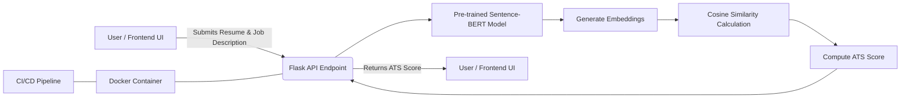

# Advanced ATS (Applicant Tracking System)

## Overview
This project is an advanced ATS (Applicant Tracking System) scoring solution that leverages a pre-trained Sentence-BERT model to compute the similarity between candidate resumes and job descriptions. The application is built using Flask and containerized with Docker. A CI/CD pipeline using GitHub Actions ensures continuous testing and automated builds.



### Explanation:

1. **User/Frontend UI** submits a resume and job description.
2. The **Flask API Endpoint** receives the data and processes it.
3. The **Sentence-BERT Model** generates embeddings.
4. Embeddings are passed to **Cosine Similarity Calculation**.
5. The system computes the **ATS Score**.
6. The **Flask API** returns the ATS score to the **User/Frontend UI**.
7. The Flask API runs inside a **Docker Container**, which is managed using a **CI/CD pipeline**.

```text
advanced_ats/
├── app/
│   ├── __init__.py         # Initializes the Flask app and loads configuration.
│   ├── routes.py           # Contains API endpoint definitions.
│   ├── model.py            # Loads the pre-trained model and defines the scoring logic.
│   ├── utils.py            # Helper functions (e.g., text preprocessing, similarity computation).
│   └── config.py           # Application configuration (e.g., model paths, API settings).
├── tests/
│   ├── test_routes.py      # Unit tests for API endpoints.
│   └── test_model.py       # Tests for model loading and scoring functions.
├── Dockerfile              # Containerization file for building the Docker image.
├── requirements.txt        # Python dependencies.
├── .gitignore              # Specifies files and folders to ignore in git.
├── README.md               # Project documentation and setup instructions.
├── run.py                  # Entry point to start the Flask server.
└── .github/
    └── workflows/
         └── ci-cd.yaml     # CI/CD pipeline configuration for automated builds and deployments.


```
## Features
- **API Endpoint**: `/score` accepts a resume and job description and returns an ATS score.
- **NLP Integration**: Uses a fine-tuned Sentence-BERT model to compute cosine similarity.
- **Swagger UI**: Accessible at `/docs/` for interactive API documentation.
- **Dockerized Deployment**: Consistent environments across development and production.
- **CI/CD Pipeline**: Automated tests and Docker image build via GitHub Actions.

## Getting Started

### Prerequisites
- Python 3.9+
- Docker
- Git (for cloning the repository)

### Setup

1. **Clone the Repository**
   ```bash
   git clone https://github.com/AmarnathaGowda/advanced_ats.git
   cd advanced_ats
   ```
2. **Create and Activate a Virtual Environment**
    ```bash
    python3 -m venv venv
    source venv/bin/activate   # On Windows use `venv\Scripts\activate`
    ```
3. **Install Dependencies**
    ```bash
    pip install -r requirements.txt
    ```
4. **Run the Application Locally**
    ```bash
    python run.py
    ```
    The API will be available at http://localhost:5000. Visit http://localhost:5000/docs/ for the Swagger UI.

5. **Docker Deployment**
    1. Build the Docker Image
    ```bash
    docker build -t advanced_ats .
    ```
    2. Run the Docker Container
    ```bash
    docker run -p 5000:5000 advanced_ats
    ```
6. **Run Unit Tests**
    ```
    pytest

    ```