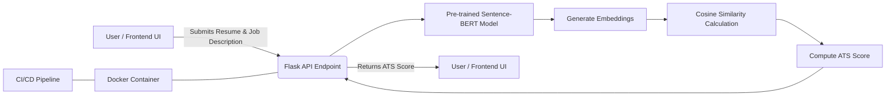

# advanced_ats
Advanced ATS Score for Enhanced Candidate Screening



### Explanation:

1. **User/Frontend UI** submits a resume and job description.
2. The **Flask API Endpoint** receives the data and processes it.
3. The **Sentence-BERT Model** generates embeddings.
4. Embeddings are passed to **Cosine Similarity Calculation**.
5. The system computes the **ATS Score**.
6. The **Flask API** returns the ATS score to the **User/Frontend UI**.
7. The Flask API runs inside a **Docker Container**, which is managed using a **CI/CD pipeline**.

```text
advanced_ats/
├── app/
│   ├── __init__.py         # Initializes the Flask app and loads configuration.
│   ├── routes.py           # Contains API endpoint definitions.
│   ├── model.py            # Loads the pre-trained model and defines the scoring logic.
│   ├── utils.py            # Helper functions (e.g., text preprocessing, similarity computation).
│   └── config.py           # Application configuration (e.g., model paths, API settings).
├── tests/
│   ├── test_routes.py      # Unit tests for API endpoints.
│   └── test_model.py       # Tests for model loading and scoring functions.
├── Dockerfile              # Containerization file for building the Docker image.
├── requirements.txt        # Python dependencies.
├── .gitignore              # Specifies files and folders to ignore in git.
├── README.md               # Project documentation and setup instructions.
├── run.py                  # Entry point to start the Flask server.
└── .github/
    └── workflows/
         └── ci-cd.yaml     # CI/CD pipeline configuration for automated builds and deployments.


```


